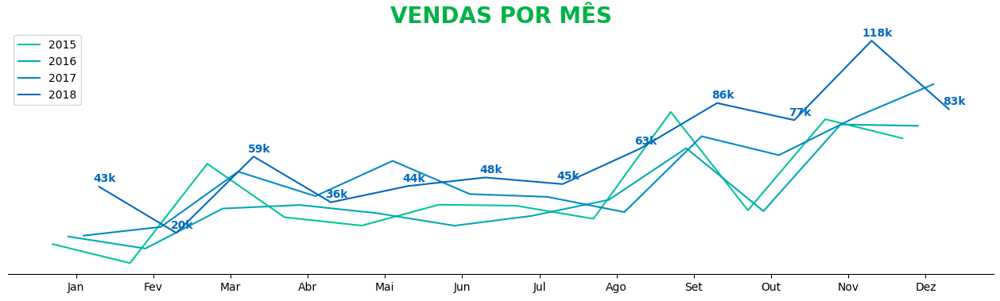

# Análise e Apresentação Executiva de Vendas



Projeto de análise exploratória e visualização de dados desenvolvido em Python, focado em transformar dados brutos de transações comerciais em insights estratégicos para tomada de decisão.

Para este projeto, foi utilizado conjunto de dados disponível no Kaggle para o ano de 2015.

 https://www.kaggle.com/datasets/rohitsahoo/sales-forecasting

## Organização do projeto

```
├── .gitignore         <- Arquivos e diretórios a serem ignorados pelo Git
├── ambiente.yml       <- O arquivo de requisitos para reproduzir o ambiente de análise
├── LICENSE            <- Licença de código aberto (MIT)
├── README.md          <- README principal para desenvolvedores que usam este projeto.
|
├── dados              <- Arquivos de dados para o projeto.
|
├── notebooks          <- Cadernos Jupyter.
│
|   └──src             <- Código-fonte para uso neste projeto.
|      │
|      ├── __init__.py  <- Torna um módulo Python
|      ├── config.py    <- Configurações básicas do projeto
|      └── estatistica.py  <- funções criadas especificamente para este projeto
|
├── referencias        <- Dicionários de dados.
|
├── relatorios         <- Análises geradas em HTML, PDF, LaTeX, etc.
│   └── imagens        <- Gráficos e figuras gerados para serem usados em relatórios
```

## Configuração do ambiente

1. Faça o clone do repositório que será criado a partir deste modelo.

    ```bash
    git clone git@github.com:juan-Cesnik/ProjetoAnaliseDeVendas.git
    ```
Lembrando que caso queria colabora faça um fork do meu repositorio para depois realizar o pull request e qualquer coisa me mande um Issues.

2. Crie um ambiente virtual para o seu projeto utilizando o `conda`.

    ```bash
    conda env create -f ambiente.yml --name coloque_o_nome_da_sua_escolha
    ```
## Um pouco mais sobre a base

[Clique aqui](referencias/Dicionario_de_dados.md) aqui para ver o dicionario de dados da base ultlizada.

### 1. Desempenho Geral de Vendas
* **Crescimento Acumulado de +50,47%:** A receita anual saltou de **US$ 479,8 mil (2015)** para **US$ 722,0 mil (2018)**, acumulando um faturamento total de **US$ 2,26 milhões** no período[cite: 1].
* **Recuperação e Tração:** Após uma retração pontual de -4,2% em 2016, as vendas aceleraram com saltos de +30,6% em 2017 e +20,3% em 2018[cite: 1].
* **Pico Sazonal no 4º Trimestre (Q4):** Os meses de **novembro (US$ 350k)**, **dezembro (US$ 321k)** e **setembro (US$ 300k)** concentraram os maiores volumes de receita anual, impulsionados por datas como *Black Friday* e compras corporativas de final de ano[cite: 1].
* **Período de Baixa:** **Janeiro e fevereiro** registraram historicamente os menores volumes de venda do ano[cite: 1].

---

### 2. Análise por Categorias e Subcategorias
* **Liderança em Faturamento:** A categoria de **Tecnologia (*Technology*)** liderou as vendas com **US$ 827,4 mil (36,6% do total)**, seguida de **Móveis (*Furniture*)** com **US$ 728,6 mil (32,2%)** e **Materiais de Escritório (*Office Supplies*)** com **US$ 705,4 mil (31,2%)**[cite: 1].
* **Subcategorias Chave:**
  * **Telefones (*Phones*)** e **Cadeiras (*Chairs*)** foram os principais motores de faturamento, gerando mais de **US$ 650 mil** combinados (~28,7% da receita total)[cite: 1].
  * **Materiais de Escritório (*Office Supplies*)** concentrou mais de **60% do volume transacional** (frequência de compras), apesar de ter menor ticket médio por item[cite: 1].

---

### 3. Produtos em Destaque
* **Maior Receita (Ticket Alto):** O produto **`Canon imageCLASS 2200 Advanced Copier`** liderou em faturamento bruto, gerando mais de **US$ 61,5 mil** em apenas 5 pedidos[cite: 1].
* **Maior Recorrência (Volume):** Itens essenciais de escritório apresentaram a maior frequência de vendas, com destaque para **Envelopes (*Staple envelope*)**, **Grampos (*Staples*)** e **Papel sulfite (*Easy-staple paper*)**, todos com mais de 40 transações registradas[cite: 1].